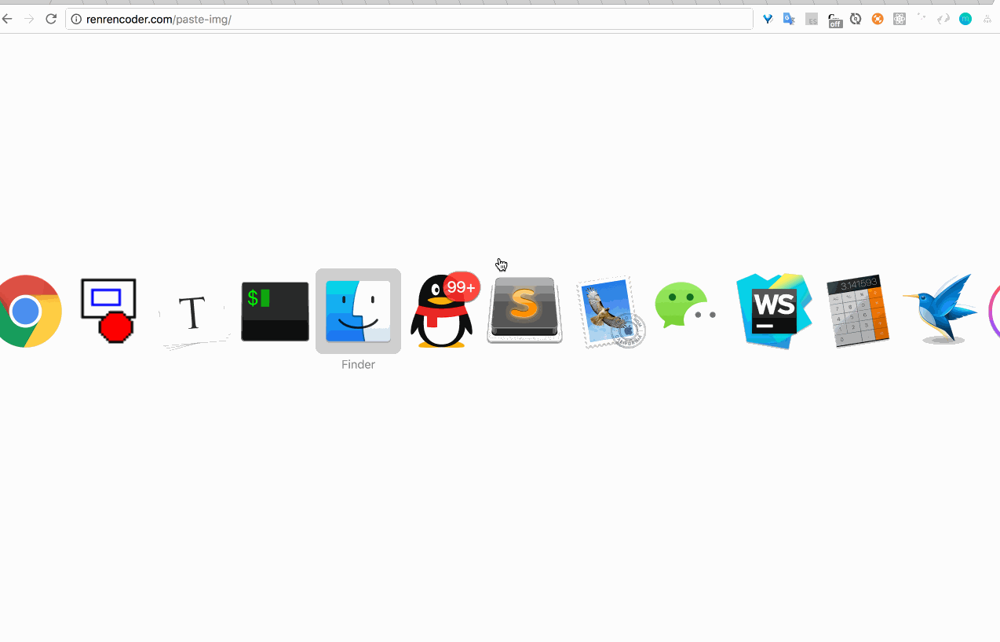

# ctrl+v粘贴图片



使用ctrl+v即可粘贴图片，可以点击[实例](http://renrencoder.com/paste-img/)，具体代码如下：

```javascript
new PasteImg({
  element: 'body',
  isUrl: true,
  callback: function(img, file){
    document.querySelector('body').appendChild(img);
    console.log(img, file);
  }
})
```

# 如何上传

如果是希望粘贴并上传图片，使用默认的base64来处理

```javascript
new PasteImg({
  element: 'body',
  callback: function(img, file){
    // 此时图片的src为base64
    console.log(img, file);
    // Todo 处理upload
    new Upload({
      url: '...',
      ...
    })
  }
})
```

